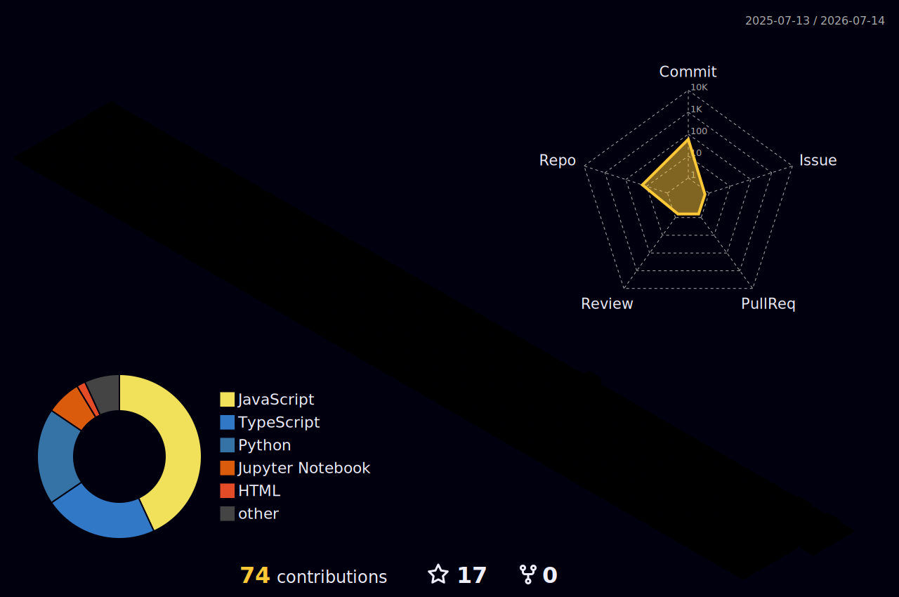

<div align="center">


</div>

<div align="center">


[](https://git.io/typing-svg)

</div>

<br/>

<div align="center">

[](https://www.rgpv.ac.in/)&nbsp;
[](https://satvix-infotech.vercel.app/)&nbsp;
[](https://maps.google.com)

</div>

<div align="center">

[](https://www.linkedin.com/in/dharshit/)&nbsp;
[](https://github.com/Harshitdubey-lab)&nbsp;
[](https://satvix-infotech.vercel.app/)

</div>

<div align="center">

&nbsp;
&nbsp;


</div>

---

## About


I am **Harshit Dubey**, currently pursuing **B.Tech in Computer Science from RGPV**. I enjoy building practical software that solves real problems, from responsive websites and business landing pages to Python tools and machine learning experiments.

My current focus is on strengthening my full stack development skills while learning machine learning, data analysis, and AI-powered application development. I like projects where I can connect frontend design, backend logic, deployment, and real user needs into one working product.

I am actively building my portfolio through projects like **Satvix Infotech**, **Resume Analyzer**, hospital and service websites, Python utilities, and beginner-to-intermediate ML models.

<br/>

**Open To**

```text
Frontend Developer | Full Stack Developer | Python Developer | ML/AI Intern
Internship | Freelance Projects | Remote | Hybrid | India
```

---

## Tech Stack

<div align="center">

### Languages
[](https://skillicons.dev)

### Frontend
[](https://skillicons.dev)

### Backend, Data & ML
[](https://skillicons.dev)

### Tools
[](https://skillicons.dev)

</div>

---

## What I Am Learning

<div align="center">

| Area | Current Focus |
|:---|:---|
| Full Stack Development | Responsive UI, routing, APIs, deployment, reusable components |
| Python Development | Automation, file handling, backend logic, data processing |
| Machine Learning | Data cleaning, model training, evaluation, customer churn prediction |
| AI Applications | Resume analysis, smart automation, practical AI tools |
| Deployment | Vercel, GitHub workflows, live project delivery |

</div>

---

## Featured Projects

<details open>
<summary><b>Satvix Infotech</b> - Business Website</summary>

<br/>

A live business website built to present services, brand identity, and a professional online presence for Satvix Infotech.

| Attribute | Details |
|:---|:---|
| **Stack** | TypeScript, modern web tooling, Vercel |
| **Live Site** | [satvix-infotech.vercel.app](https://satvix-infotech.vercel.app/) |
| **Repository** | [Harshitdubey-lab/satvix.infotech](https://github.com/Harshitdubey-lab/satvix.infotech) |

</details>

<details>
<summary><b>Resume Analyzer</b> - AI/ML Application</summary>

<br/>

A resume analysis project focused on extracting useful information from resumes and helping users understand resume quality, structure, and improvement areas.

| Attribute | Details |
|:---|:---|
| **Stack** | Python, frontend/backend application structure |
| **Focus** | Resume parsing, analysis workflow, practical AI use case |
| **Repository** | [Harshitdubey-lab/Resume_analyzer](https://github.com/Harshitdubey-lab/Resume_analyzer) |

</details>

<details>
<summary><b>Hospital Site</b> - Service Website</summary>

<br/>

A responsive hospital website project designed around service presentation, navigation, and a user-friendly web experience.

| Attribute | Details |
|:---|:---|
| **Stack** | JavaScript, HTML, CSS |
| **Live Site** | [hospital-site-eight.vercel.app](https://hospital-site-eight.vercel.app) |
| **Repository** | [Harshitdubey-lab/Hospital_site](https://github.com/Harshitdubey-lab/Hospital_site) |

</details>

<details>
<summary><b>Customer Churn Prediction</b> - Machine Learning Model</summary>

<br/>

A machine learning project using notebook-based experimentation to understand customer churn patterns and build predictive modeling skills.

| Attribute | Details |
|:---|:---|
| **Stack** | Jupyter Notebook, Python, ML workflow |
| **Focus** | Data preprocessing, model training, evaluation |
| **Repository** | [Harshitdubey-lab/MLmodel_customer_churn_prediction_dataset-](https://github.com/Harshitdubey-lab/MLmodel_customer_churn_prediction_dataset-) |

</details>

<details>
<summary><b>Frontend Clone Projects</b> - UI Practice</summary>

<br/>

Frontend practice projects built to improve layout, styling, responsive design, and UI recreation skills.

| Project | Repository |
|:---|:---|
| Amazon Clone | [Harshitdubey-lab/Amazon](https://github.com/Harshitdubey-lab/Amazon) |
| Blinkit Clone | [Harshitdubey-lab/Blinkit-clone](https://github.com/Harshitdubey-lab/Blinkit-clone) |
| Spotify Clone | [Harshitdubey-lab/Spotify-clone](https://github.com/Harshitdubey-lab/Spotify-clone) |
| School Website | [Harshitdubey-lab/school-website](https://github.com/Harshitdubey-lab/school-website) |

</details>

---

## GitHub Analytics

<div align="center">


</div>

<div align="center">


</div>

---

## Contribution Map

<div align="center">



</div>

---

## Current Focus

```yaml
current_focus:
  education:
    - "B.Tech Computer Science from RGPV"

  building:
    - "Satvix Infotech website"
    - "Resume Analyzer"
    - "Hospital and business websites"
    - "Python and machine learning practice projects"

  learning:
    - "Full stack development"
    - "Python backend development"
    - "Machine learning fundamentals"
    - "AI-powered web applications"

  open_to:
    - "Internships"
    - "Freelance web projects"
    - "Frontend and full stack developer roles"
    - "Python and ML beginner roles"
```

---

## Connect

<div align="center">

[](https://www.linkedin.com/in/dharshit/)&nbsp;
[](https://github.com/Harshitdubey-lab)&nbsp;
[](https://satvix-infotech.vercel.app/)

</div>

---

<div align="center">

<b>Building, learning, and improving one project at a time.</b>


</div>
